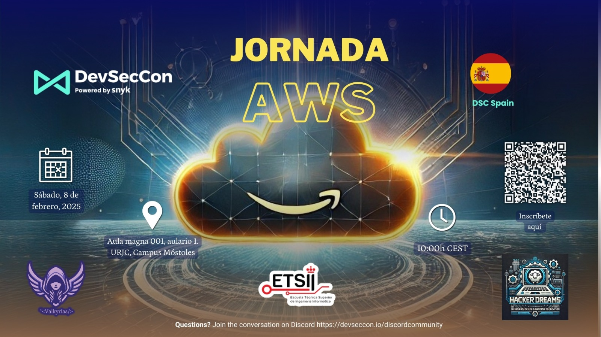

# Jornada AWS 2025
# 

## 🎬 Grabación del evento

**Agenda del Evento**

10:00 AM - Puertas Abiertas Recibimiento y networking inicial.

10:30 AM - 10:45 AM - Presentación del Evento Introducción a la jornada y breve resumen de las sesiones.

**10:45 AM - 11:45 AM - AWS Lambda Power Tuning: Una comparativa entre arquitecturas x86_64 y arm64**

**Ponente**: Oscar Cortes: Cloud Architect at ACKStorm.

Descripción:
Desde la aparición de la herramienta de Lambda Power Tuning, es menos usada de lo que podría haber imaginado. Sin embargo, entre las nuevas funcionalidades y mejoras que constantemente van agregando desde la comunidad, así como la discusión dentro de los equipos de desarrollo sobre migrar sus lambdas a una arquitectura de Arm64, podría ser interesante reflotar esta herramienta y sacarle todo el jugo posible. En esta charla, explicaré cómo utilizar Lambda Power Tuning, así como los resultados de pruebas entre arquitecturas (X86, Arm64).

11:45 AM - 11:55 AM - Cambio de ponente

**11:55 AM - 12:55 PM - Quiero ser DevOps en AWS: Por dónde empiezo**

**Ponente**: Armando Felipe Fuentes Denis: Cloud Architect.

**Descripción**:
¿Has escuchado hablar de DevOps y sueñas con convertirte en un experto en AWS, pero no sabes cómo dar el primer paso? En esta charla, exploraremos juntos el emocionante mundo del DevOps aplicado a AWS, desde los fundamentos hasta las herramientas y habilidades necesarias para destacar en esta área.

Descubre qué es realmente DevOps y cómo AWS te proporciona un ecosistema completo para automatizar, optimizar y escalar aplicaciones.

Además, compartiré consejos prácticos basados en mi experiencia profesional, proyectos reales y el aprendizaje continuo en esta disciplina. Esta charla está diseñada para principiantes que quieren iniciar su camino y también para profesionales que buscan estructurar su carrera en DevOps en la nube.

12:55 PM - 1:05 PM - Cambio de ponente

**1:05 PM - 2:05 PM - Migrando aplicaciones a AWS Graviton en Amazon EKS**

**Ponente**: Christian Melendez: Sr. Specialist Solutions Architect, Compute at AWS.

**Descripción**:
Los procesadores AWS Graviton están diseñados para ofrecer el mejor rendimiento/precio para tus cargas de trabajo que corren en Amazon EC2. Durante esta sesión, revisaremos los pasos para migrar una aplicación que corre en x86 a instancias basadas en AWS Graviton. Te mostraré con una prueba de rendimiento por qué Graviton va mejor, exploraremos pipelines de CI/CD para construir y desplegar la aplicación en Amazon EKS usando Karpenter. Aprenderás cómo se pueden desplegar aplicaciones de manera eficiente mezclando instancias basadas en AWS Graviton e Instancias Spot de Amazon EC2. Prometo usar muy pocas diapositivas.

2:05 PM – Pizzas y Networking Oportunidad para preguntas, interacción entre asistentes y networking final.
